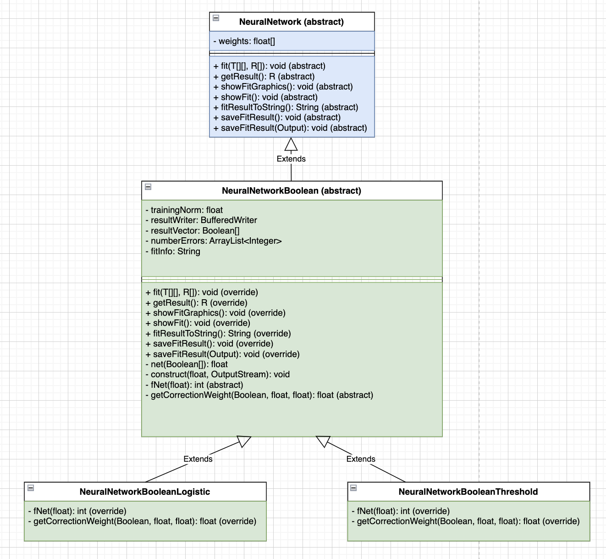

# Лабораторные работы по курсу "Интеллектуальные технологии информационной безопасности"

## Лабораторная работа №1 "Исследование однослойных нейронных сетей на примере моделирования булевых выражений"
## Вариант №12

**Цель работы** - иследовать функционирование простейшей нейронной сети на базе нейрона с нелинейной функцией активации и обучить ее по правилу Видроу - Хоффа.

[Методическое пособие](study_guides/MetodichkaII_2017.pdf) к лабораторной работе.

Структура проекта:

Моделируемая функция:

 
Точка входа лабораторной работы [test_1](src/test/java/Test_1.java)

Результаты работы программы:

* Пороговая функция

* Логистическая функция
