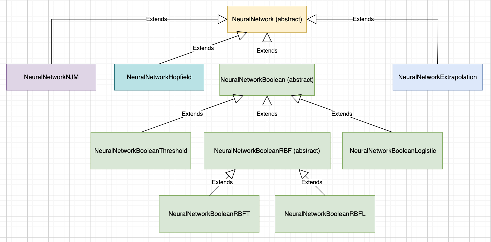
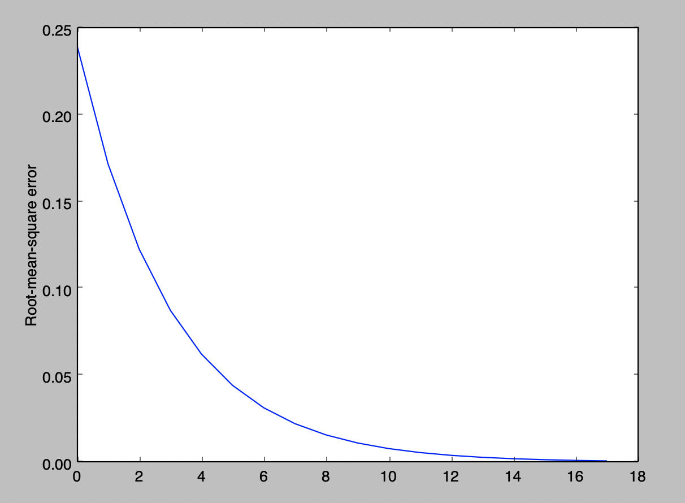

# Лабораторные работы по курсу "Интеллектуальные технологии информационной безопасности"

**Структура проекта:**

## Лабораторная работа №1 "Исследование однослойных нейронных сетей на примере моделирования булевых выражений"
### Вариант №12

**Цель работы** - исследовать функционирование простейшей нейронной сети на базе нейрона с нелинейной функцией активации и обучить ее по правилу Видроу - Хоффа.

[Методическое пособие](study_guides/MetodichkaII_2017.pdf) к лабораторной работе.

Моделируемая функция:

 
Точка входа лабораторной работы [test_1](src/test/java/Lab_1.java)

Результаты работы программы:

* Пороговая функция

* Логистическая функция

## Лабораторная работа №2 "Применение однослойной нейронной сети с линейной функцией активации для прогнозирования временных рядов"
### Вариант 11
**Цель работы** - изучить возможности однослойной нейронной сети в задачах прогнозирования временных рядов методом скользящего окна (авторегрессия).

[Методическое пособие](study_guides/MetodichkaII_2017.pdf) к лабораторной работе.

Моделируемая функция:

Точка входа лабораторной работы [test_2](src/test/java/Lab_2.java)

Результат работы программы:

* График среднеквадратичной ошибки

* График прогнозируемой функции

## Лабораторная работа №6 "Изучения алгоритма обратного распространения ошибки (метод Back Propagation)"
### Вариант №12

**Цель работы** - исследовать функционирование многослойной нейронной сети прямого распространения и ее обучения методом обратного распространения ошибки

[Методическое пособие](study_guides/MetodichkaII_2017.pdf) к лабораторной работе.

Вариант задания (#12):

Точка входа лабораторной работы [test_4](src/test/java/Lab_4.java)

Результат работы программы:

График среднеквадратичной ошибки

Вывод программы представлен в файле [lab_4](results/lab_4.txt)
